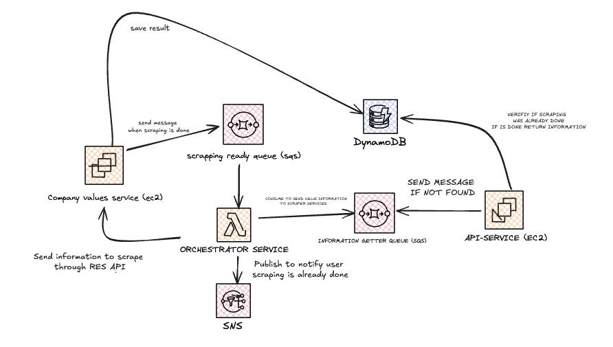

## Company Profiler

This project is a web scraping project that aims to scrape company values from a given URL.

## Services

1. [API Service](api-service/readme.md)
2. [Orchestrator Service](orchestrator-service/README.md)
3. [Company Values Service](company-values-service/readme.md)
4. [Infrastructure](infra/readme.md)

## Tecnical decisions

1. Used [NestJS](https://github.com/nestjs/nest) as the main framework for the API service and the orchestrator service.

2. Used [Puppeteer](https://github.com/puppeteer/puppeteer) to scrape the company values from the given URL.

3. Used [Groq](https://github.com/evanw/node-groq) to parse the HTML and extract the information from the pages.

4. Used [AWS SDK for JavaScript](https://github.com/aws/aws-sdk-js) to interact with AWS services.

5. Used EC2 instance to run the scraping process because it takes a long time to scrape the information from a given URL and also might be blocked by the website and should be re tried multiple times.

6. Used [Serverless Framework](https://github.com/serverless/serverless) to deploy the infrastructure.

## Prerequisites

1. Node.js 18.x
2. AWS CLI
3. You must have an AWS account and have the necessary permissions to create resources in the AWS account and also set up the AWS CLI with the appropriate credentials.
4. You must have a LinkedIn account and have the necessary permissions to access the Linkedin API.

## Architecture

